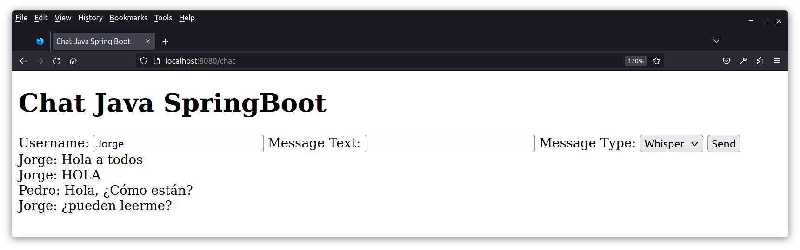

# Chat Java SpringBoot

### Dependencias

* Spring Web
* Thymeleaf
* Spring Boot DevTools

### Avances

* Endpoint: "localhost:8080/chat".
* Los usuarios deben escribir su nombre de usuario y el mensaje, pueden seleccionar entre tres formatos de texto: normal (Say), mayúsculas (Shout), minúsculas (Whisper). Los mensajes se guardan en una lista en memoria.

### Puntos a resolver

* Hacer que el chat se actualice automáticamente para todos los usuairos cuando un usuario cualquiera envía un mensaje. Hasta el momento se actualiza unicamente para el usuario que envía el mensaje.
* Implementar autenticación.
* Implementar persistencia.
