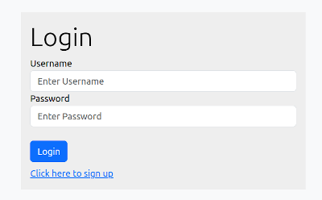

# Chat Java Spring Boot

### Dependencias

* Spring Web
* Spring Security
* MyBatis
* H2 Database
* Thymeleaf
* Spring Boot DevTools

### Descripción
Es un chat en el que los usuarios se pueden "registrar" y después "logear" para intercambiar mensajes. Los nombres de usuario y contraseñas, así como los mensajes, se guardan en una base de datos SQL (in-memory). Las contraseñas se guardan "hasheadas".

Se utiliza la clase "WebSecurityConfigureAdapter", sin embargo es una clase "obsoleta" que no aparece en las versiones más actuales de Spring Security.

### Puntos a resolver

* Hacer que el chat se actualice automáticamente para todos los usuairos cuando un usuario cualquiera envía un mensaje. Hasta el momento se actualiza unicamente para el usuario que envía el mensaje.

